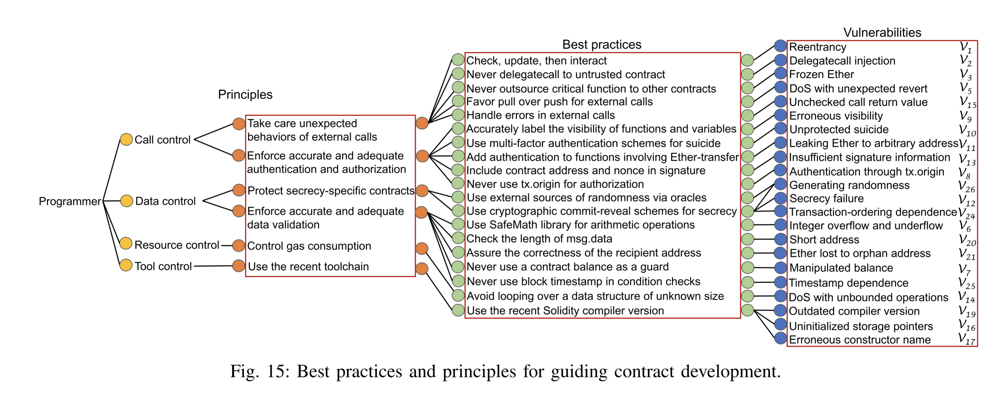
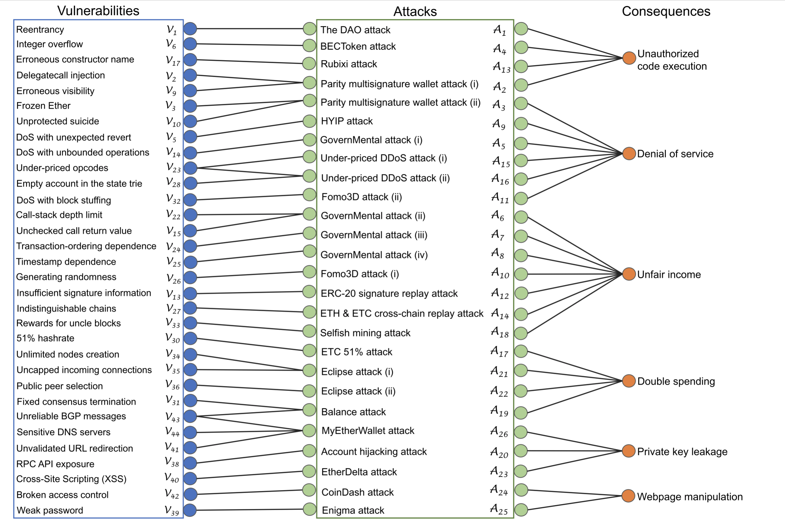
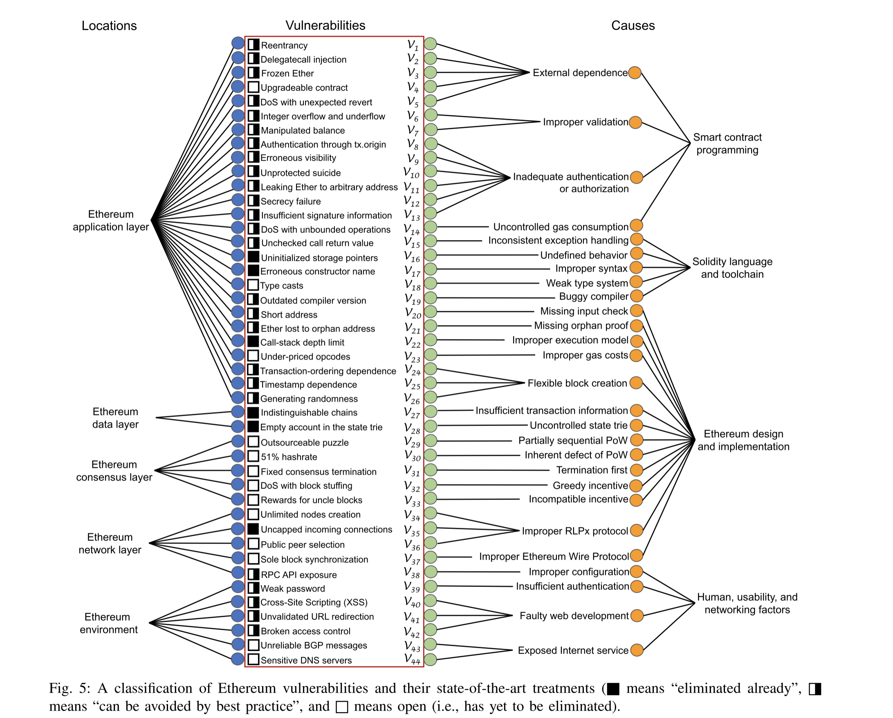

# Survey on Ethereum Tools and Defenses 

> source [A Survey on Ethereum Systems Security: Vulnerabilities, Attacks and Defenses](https://arxiv.org/abs/1908.04507)

 

## Overview

 

 

 

## Reactive defense && Proactive defense

### Defenses 
Security enhancement
Runtime verification
Alternate languages
Contract best practices
Contract analyzer
Blockchain protocols

## Best Practices 

Check, update, then interact
Never delegatecall to untrusted contract
Favor pull over push for external calls
Never outsource critical function to other contracts
Handle errors in external calls
Include contract address and nonce in signature
Accurately label the visibility of functions and variables
Never use a contract balance as a guard
Check the length of msg.data
Use external sources of randomness via oracles
Assure the correctness of the recipient address
Never use block timestamp in condition checks
Avoid looping over a data structure of unknown size
Use the recent Solidity compiler version
Use SafeMath library for arithmetic operations
Use multi-factor authentication schemes for suicide
Add authentication to functions involving Ether-transfer
Use cryptographic commit-reveal schemes for secrecy
Never use tx.origin for authorization
